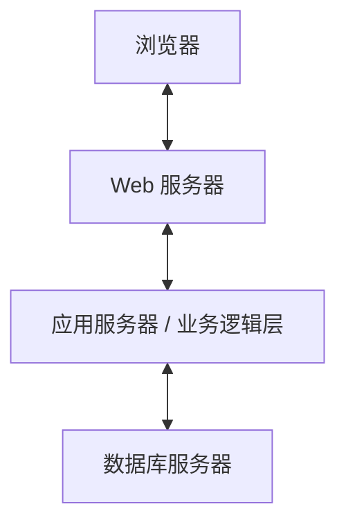
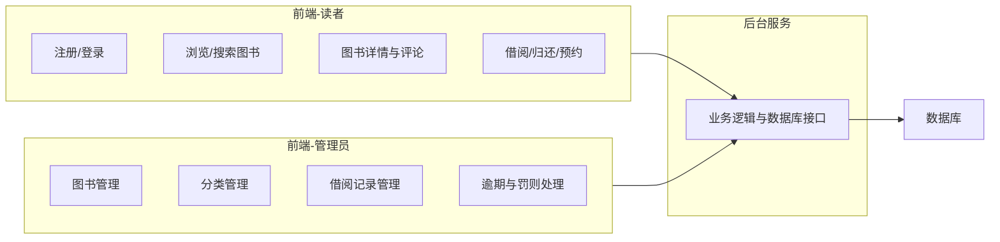
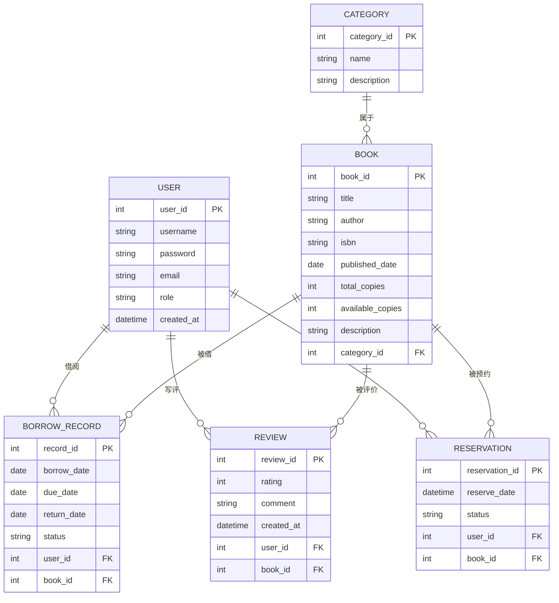
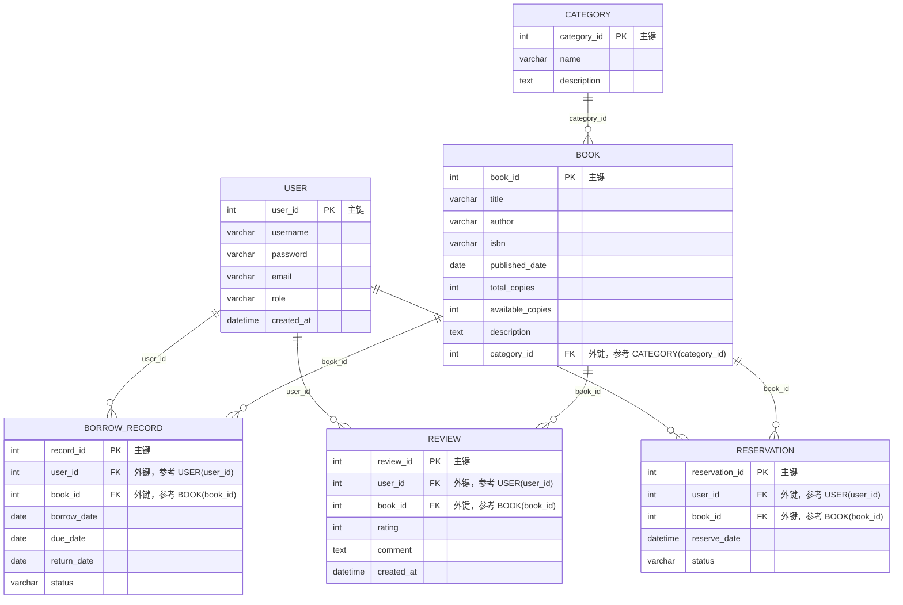

下面以 **“在线图书管理系统”** 为例，完成这一数据库应用的设计文档。该系统采用 B/S 结构，前端为网页，后台数据库包含 6 个表，具备用户管理、图书浏览、借阅归还、评论、预约等功能。

---

# 在线图书管理系统数据库设计文档

## 摘要
本课程设计实现了一个基于 B/S 架构的在线图书管理系统，前端使用网页呈现，后台采用关系数据库进行数据存储与管理。系统主要特色包括：支持读者和管理员两种角色的权限控制；实现图书的借阅、归还、预约和评论功能；利用存储过程和触发器保证借阅业务的数据一致性与自动化处理；设计了合理的索引与视图以提升查询效率。通过本项目，加深了对数据库概念设计、逻辑设计、物理设计全流程的理解，掌握了 SQL 高级特性在实际项目中的应用，提升了前后端协同的系统设计能力。

## 1 引言
### 1.1 选题背景与意义
图书管理是信息管理领域的经典场景，涉及实体多、关系复杂，能较好地体现数据库设计的核心问题。随着数字化阅读和馆藏信息化的发展，传统人工管理方式效率低、易出错。开发一个在线图书管理系统，可以方便读者检索、借阅、评价图书，也便于管理员管理馆藏和借阅记录。选择这一题目，能全面覆盖实体联系建模、范式化设计、复杂查询与事务处理等数据库课程重点内容，具有较强的实践意义。

### 1.2 系统功能概述
- 用户注册与登录，区分读者和管理员角色。
- 读者可浏览、搜索图书，查看图书详情、评论和评分。
- 读者可借阅在馆图书、归还已借图书、预约已被借出的图书。
- 读者可对已借阅的图书发表评论和评分。
- 管理员可增删改图书信息，管理分类，查看所有借阅记录，处理逾期等。
- 系统自动更新图书的可借副本数，检测逾期情况。

### 1.3 个人收获
通过本项目，掌握了从需求分析到数据库物理实现的完整流程，熟练使用 ER 图进行概念建模，将概念模型转换为满足第三范式的关系模式，并利用视图、索引、存储过程和触发器等优化系统性能和保证数据完整性。

### 1.4 本文组织
第二部分介绍完成项目的相关技术背景；第三部分给出系统的整体框架和功能模块划分；第四部分详细描述关系数据库模式，包括 ER 图、关系模式及其范式、索引与视图设计、存储过程与触发器，以及核心功能的 SQL 实现；第五部分总结全文并阐述收获。

## 2 相关工作
本系统采用如下技术栈：
- **前端**：HTML、CSS、JavaScript，用于构建用户交互界面。
- **后端**：可采用 Python Flask / Node.js / Java Spring Boot 等任一 Web 框架处理业务逻辑，通过 RESTful API 与前端交互。
- **数据库**：使用 MySQL、PostgreSQL 等关系数据库管理系统，支持事务、存储过程、触发器等高级特性。
- **设计工具**：使用 PowerDesigner 或在线绘图工具（如 draw.io、ERDPlus）绘制 ER 图和物理数据模型图。

## 3 课程设计的系统框架
### 3.1 整体架构
系统采用典型的三层 B/S 架构，如下图所示。



**图1 系统整体架构图**  
用户通过浏览器发送请求，Web 服务器处理静态资源并转发动态请求至应用服务器，应用服务器执行业务逻辑并通过 SQL 与数据库交互，最终将结果返回浏览器。

### 3.2 功能模块划分
系统分为前端功能模块和后端管理模块，其结构见图2。



**图2 系统功能模块图**

- **用户模块**：处理注册、登录、角色验证，维护用户会话。
- **图书模块**：图书的增删改查、按分类筛选、关键词搜索，展示在馆副本数。
- **借阅模块**：借书时检查可借副本、生成借阅记录、扣减库存；还书时更新记录、恢复库存；预约管理及到书通知。
- **评论模块**：读者对已借阅图书评分和评论，防止重复评论。
- **管理模块**：管理员查阅所有用户、图书、借阅记录，手动处理异常（如丢失赔偿）。

## 4 课程设计对应的关系数据库模式
### 4.1 ER 图
数据库概念设计使用 ER 图表示实体及其联系，主要实体有：用户、图书、分类、借阅记录、评论、预约记录。



**图3 数据库 ER 图**  
用户与借阅记录是一对多关系，一个用户可以多次借阅；图书与借阅记录是一对多关系。用户对已借图书发表评论，同样是一对多。当图书可用副本为0时，读者可预约，预约实体记录预约时间和状态。分类与图书为一对多关系。

### 4.2 关系数据库模式描述
将 ER 图转换为物理关系模式，共6张表，主键及外键标识如下（可通过 PowerDesigner 生成物理模型图）。



**图4 关系数据库物理模式图**（箭头表示外键关联）

#### 各表范式说明
- **USER**、**CATEGORY**、**BOOK** 表：每个非主属性完全函数依赖于主键，不存在部分依赖和传递依赖，满足第三范式（3NF）。
- **BORROW_RECORD**：所有属性直接依赖于主键 `record_id`，传递依赖不存在（如用户信息仅通过 `user_id` 关联，不存储用户名等冗余字段），满足 3NF。
- **REVIEW**：满足 3NF，`rating` 和 `comment` 仅依赖于主键，用户和图书信息通过外键关联。
- **RESERVATION**：同样满足 3NF。

#### 视图设计
1. **view_borrow_details**：将借阅记录与用户、图书信息联结，便于查询借阅明细。
```sql
CREATE VIEW view_borrow_details AS
SELECT br.record_id, u.username, b.title, b.author,
       br.borrow_date, br.due_date, br.return_date, br.status
FROM BORROW_RECORD br
JOIN USER u ON br.user_id = u.user_id
JOIN BOOK b ON br.book_id = b.book_id;
```

2. **view_book_rating**：展示每本书的平均评分和评论数。
```sql
CREATE VIEW view_book_rating AS
SELECT b.book_id, b.title, AVG(r.rating) AS avg_rating, COUNT(r.review_id) AS review_count
FROM BOOK b
LEFT JOIN REVIEW r ON b.book_id = r.book_id
GROUP BY b.book_id, b.title;
```

#### 索引设计
- 在 `BORROW_RECORD(user_id)` 上创建索引，加速查询用户借阅历史。
- 在 `BORROW_RECORD(book_id, status)` 上创建复合索引，优化“某本书当前是否在借”的查询。
- 在 `BOOK(title)` 和 `BOOK(author)` 上建立全文索引或普通索引，支持模糊搜索。
- 在 `REVIEW(book_id)` 上建立索引，加速评论聚合查询。

#### 存储过程与触发器
1. **存储过程 sp_borrow_book**：执行借书操作，包含事务：检查可用副本数，若>0则插入借阅记录并更新 `available_copies` 减1，否则抛出异常。
2. **存储过程 sp_return_book**：还书操作，更新借阅记录的归还日期和状态，并将 `available_copies` 加1。
3. **触发器 trg_after_return**：在借阅记录状态更新为“已还”后，自动检查该书是否有预约记录，若有则将最早预约的状态更新为“可借”或自动转为借阅（根据业务规则）。
4. **触发器 trg_prevent_duplicate_review**：在插入评论前，判断用户是否借阅过该书且未还，限制只有借阅并归还后才有评论资格；同时确保一用户对一图书只有一条评论。

### 4.3 关系数据库模式之上的操作
以下为核心功能的 SQL 实现示例。

**功能1：读者借书（事务处理）**
```sql
-- 存储过程 sp_borrow_book 核心逻辑
CREATE PROCEDURE sp_borrow_book(IN p_user_id INT, IN p_book_id INT)
BEGIN
    DECLARE avail INT;
    DECLARE due DATE DEFAULT DATE_ADD(CURDATE(), INTERVAL 30 DAY);
    START TRANSACTION;
    -- 锁定图书行防止并发超借
    SELECT available_copies INTO avail FROM BOOK WHERE book_id = p_book_id FOR UPDATE;
    IF avail > 0 THEN
        INSERT INTO BORROW_RECORD(user_id, book_id, borrow_date, due_date, status)
        VALUES(p_user_id, p_book_id, CURDATE(), due, '借出');
        UPDATE BOOK SET available_copies = available_copies - 1 WHERE book_id = p_book_id;
        COMMIT;
    ELSE
        ROLLBACK;
        SIGNAL SQLSTATE '45000' SET MESSAGE_TEXT = '图书无可用副本';
    END IF;
END;
```

**功能2：查询某用户当前借阅历史及逾期情况**
```sql
SELECT br.record_id, b.title, br.borrow_date, br.due_date,
       CASE WHEN br.return_date IS NULL AND br.due_date < CURDATE() THEN '逾期'
            ELSE br.status END AS current_status
FROM BORROW_RECORD br
JOIN BOOK b ON br.book_id = b.book_id
WHERE br.user_id = 1
ORDER BY br.borrow_date DESC;
```

**功能3：查询热门图书 Top 5（基于借阅次数）**
```sql
SELECT b.book_id, b.title, COUNT(br.record_id) AS borrow_count
FROM BOOK b
LEFT JOIN BORROW_RECORD br ON b.book_id = br.book_id
GROUP BY b.book_id, b.title
ORDER BY borrow_count DESC
LIMIT 5;
```

**功能4：预约到期自动取消（事件调度，可选）**
```sql
CREATE EVENT ev_auto_cancel_reservation
ON SCHEDULE EVERY 1 DAY
DO
  UPDATE RESERVATION SET status = '已取消'
  WHERE status = '待处理' AND reserve_date < DATE_SUB(CURDATE(), INTERVAL 7 DAY);
```

**功能5：管理员查看逾期未还图书及用户联系方式**
```sql
SELECT u.username, u.email, b.title, br.borrow_date, br.due_date,
       DATEDIFF(CURDATE(), br.due_date) AS overdue_days
FROM BORROW_RECORD br
JOIN USER u ON br.user_id = u.user_id
JOIN BOOK b ON br.book_id = b.book_id
WHERE br.status = '借出' AND br.due_date < CURDATE();
```

## 5 总结
### 项目总结
本课程设计完成了一个功能完整、结构清晰的在线图书管理系统。数据库包含用户、图书、分类、借阅记录、评论和预约6张表，通过外键建立严谨的关联，表设计均满足3NF要求。系统设计了视图简化复杂查询，建立索引提升常用查询性能，并利用存储过程和触发器保障借阅业务的事务性和自动化处理。整体架构采用 B/S 模式，模块划分明确，可扩展性和维护性较强。

### 个人收获
通过完整实现该项目，我深刻理解了数据库设计从需求分析、概念建模到物理实现的全过程。在画 ER 图时，学会了如何识别实体、属性和联系，并精准定义基数约束；在转换为关系模式时，掌握了范式分析的方法，避免了数据冗余和更新异常。编写复杂 SQL 和存储过程时，实践了事务控制、锁定机制以及错误处理，对数据库完整性和并发控制有了更直观的认识。同时，视图和索引的设计使我体会到“以空间换时间”的优化思想在真实应用中的重要性。本次实践有效巩固了课堂理论知识，为今后从事软件开发工作打下了坚实的数据库设计基础。