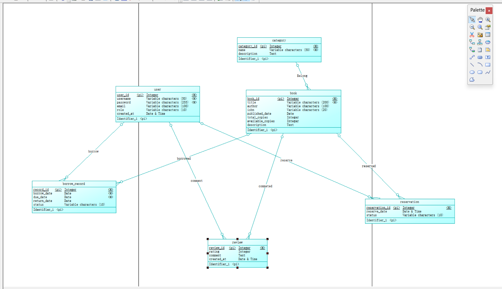
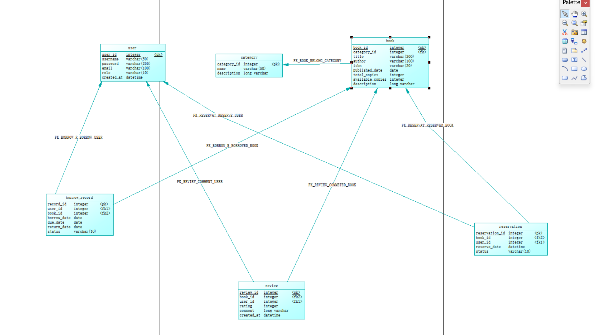

# 在线图书管理系统数据库设计文档

## 摘要

本课程设计实现了一个基于 B/S 架构的在线图书管理系统，前端使用网页呈现，后台采用 SQL Server 关系数据库进行数据存储与管理。系统支持读者和管理员两种角色的权限控制，实现图书的借阅、归还、预约和评论功能，利用 Python 应用层事务保证借阅业务的数据一致性，并通过视图、索引和 CHECK/UNIQUE 约束保障数据完整性。通过本项目，加深了对数据库概念设计、逻辑设计、物理设计全流程的理解，掌握了 SQL 高级特性在实际项目中的应用，提升了前后端协同的系统设计能力。

## 1 引言

### 1.1 选题背景与意义

图书管理是信息管理领域的经典场景，涉及实体多、关系复杂，能较好地体现数据库设计的核心问题。随着数字化阅读和馆藏信息化的发展，传统人工管理方式效率低、易出错。开发一个在线图书管理系统，可以方便读者检索、借阅、评价图书，也便于管理员管理馆藏和借阅记录。选择这一题目，能全面覆盖实体联系建模、范式化设计、复杂查询与事务处理等数据库课程重点内容，具有较强的实践意义。

### 1.2 系统功能概述

- 用户注册与登录，区分读者和管理员角色。
- 读者可浏览、搜索图书，查看图书详情、评论和评分。
- 读者可借阅在馆图书、归还已借图书、预约已被借出的图书。
- 读者可对已借阅并归还的图书发表评论和评分（一人一书仅一评）。
- 图书无可用副本时，读者可预约，归还后自动通知预约者。
- 管理员可增删改图书和分类，查看所有借阅与预约记录，强制归还，处理逾期。
- 系统自动更新图书的可借副本数，检测逾期情况。
- 首页展示热门图书（借阅次数 Top 5）和高分推荐（平均评分最高 6 本）。

### 1.3 个人收获

通过本项目，掌握了从需求分析到数据库物理实现的完整流程，熟练使用 PowerDesigner 绘制 ER 图和物理数据模型图，将概念模型转换为满足第三范式的关系模式，并利用视图、索引、CHECK 约束和 UNIQUE 约束优化系统性能与保证数据完整性。在 Python 后端中实践了事务控制、并发处理和错误恢复机制，对数据库完整性和应用层事务有了更直观的认识。

### 1.4 本文组织

第二部分介绍完成项目的技术背景；第三部分给出系统的整体框架和功能模块划分；第四部分详细描述关系数据库模式，包括 ER 图、关系模式及其范式、索引与视图设计、事务流程与约束，以及核心功能的 SQL 实现；第五部分总结全文并阐述收获。

## 2 技术背景

本系统采用如下技术栈：

- **前端**：HTML5 + CSS3 + Vanilla JavaScript，自定义"墨香书院"白底深红主题，响应式布局，无前端框架依赖。
- **后端**：Python 3 + Flask Web 框架，通过 pyodbc 驱动连接 SQL Server，RESTful 路由处理业务逻辑。
- **数据库**：Microsoft SQL Server，支持事务、视图、索引、CHECK 约束、UNIQUE 约束、IDENTITY 自增列等特性。事务（借书/还书）在 Python 应用层显式控制（BEGIN TRANSACTION / COMMIT / ROLLBACK）。
- **设计工具**：PowerDesigner 16.5 绘制 ER 图（概念模型）和物理数据模型图。

## 3 系统框架

### 3.1 整体架构

系统采用典型的三层 B/S 架构：

```
┌──────────┐      ┌─────────────────┐      ┌──────────────┐
│  浏览器   │ <--> │  Flask 应用服务器 │ <--> │  SQL Server  │
│ (HTML/JS) │      │  (Python 业务逻辑) │      │  (关系数据库)  │
└──────────┘      └─────────────────┘      └──────────────┘
```

**图1 系统整体架构图**

用户通过浏览器发送请求，Flask 路由处理请求参数，调用 Database 数据访问层执行 SQL，通过 pyodbc 与 SQL Server 交互，最终将数据渲染为 HTML 页面返回浏览器。

### 3.2 功能模块划分

系统分为读者前端和管理员前端两大模块：

```
┌──────────────────┐     ┌──────────────────┐
│    读者模块       │     │    管理员模块      │
├──────────────────┤     ├──────────────────┤
│ · 注册 / 登录     │     │ · 仪表盘（统计）   │
│ · 浏览 / 搜索图书  │     │ · 图书 CRUD       │
│ · 图书详情与评论   │     │ · 分类管理         │
│ · 借阅 / 归还     │     │ · 借阅记录管理     │
│ · 预约 / 取消预约  │     │ · 预约记录查看     │
│ · 我的借阅 / 预约  │     │ · 强制归还         │
└──────┬───────────┘     └────────┬─────────┘
       │                         │
       └──────────┬──────────────┘
                  │
       ┌──────────▼──────────┐
       │   Database 抽象层    │
       │   (db.py / pyodbc)  │
       └──────────┬──────────┘
                  │
       ┌──────────▼──────────┐
       │    SQL Server       │
       └─────────────────────┘
```

**图2 系统功能模块图**

- **用户模块**：处理注册、登录、角色验证，SHA-256 密码哈希，Flask session 维护会话。
- **图书模块**：图书的增删改查、按分类筛选、书名/作者模糊搜索（LIKE），展示在馆副本数。
- **借阅模块**：借书时显式事务控制——检查可借副本 → 插入借阅记录 → 扣减库存；还书时——更新记录状态 → 恢复库存 → 自动触发预约检查并通知。
- **评论模块**：仅借阅并归还后可评，一人一书一条（UNIQUE 约束 + 应用层校验），评分 1–5（CHECK 约束）。
- **预约模块**：副本为 0 时可预约，归还后自动将最早预约标记为"可借"。
- **管理模块**：管理员查阅所有用户、图书、借阅记录，手动强制归还。

## 4 关系数据库模式

### 4.1 ER 图（概念模型）

数据库概念设计使用 ER 图表示实体及其联系，主要实体有：用户、图书、分类、借阅记录、评论、预约记录。



**图3 数据库 ER 图**

用户与借阅记录是一对多关系，一个用户可以多次借阅；图书与借阅记录是一对多关系。用户对已借图书发表评论，同样是一对多关系——但通过应用层限制只有归还后可评，且 UNIQUE(user_id, book_id) 确保一人一评。当图书可用副本为 0 时，读者可预约，预约实体记录预约时间和状态。分类与图书为一对多关系，每本书属于一个分类。

### 4.2 物理数据模型

将 ER 图转换为物理关系模式，共 6 张表，主键使用 IDENTITY(1,1) 自增，外键关联清晰。



**图4 关系数据库物理模式图**（本图由 PowerDesigner 生成）

#### 各表范式说明

- **user**、**category**、**book** 表：每个非主属性完全函数依赖于主键，不存在部分依赖和传递依赖，满足第三范式（3NF）。
- **borrow_record**：所有属性直接依赖于主键 `record_id`，用户信息仅通过 `user_id` 关联（不存储用户名等冗余字段），满足 3NF。
- **review**：满足 3NF，`rating` 和 `comment` 仅依赖于主键，用户和图书信息通过外键关联。
- **reservation**：同样满足 3NF。

#### 视图设计

1. **view_borrow_details**：将借阅记录与用户、图书信息联结，便于查询借阅明细。

```sql
CREATE VIEW view_borrow_details AS
SELECT br.record_id, u.username, b.title, b.author,
       br.borrow_date, br.due_date, br.return_date, br.status
FROM borrow_record br
JOIN [user] u ON br.user_id = u.user_id
JOIN book b ON br.book_id = b.book_id;
```

2. **view_book_rating**：展示每本书的平均评分和评论数。

```sql
CREATE VIEW view_book_rating AS
SELECT b.book_id, b.title, b.author,
       ROUND(CAST(AVG(CAST(r.rating AS FLOAT)) AS FLOAT), 1) AS avg_rating,
       COUNT(r.review_id) AS review_count
FROM book b
LEFT JOIN review r ON b.book_id = r.book_id
GROUP BY b.book_id, b.title, b.author;
```

#### 索引设计

| 索引名 | 表 | 列 | 用途 |
|--------|-----|-----|------|
| borrow_FK | borrow_record | user_id | 加速用户借阅历史查询 |
| borrowed_FK | borrow_record | book_id | 加速图书借阅状态查询 |
| idx_br_book_status | borrow_record | (book_id, status) | 优化"某书是否在借"复合查询 |
| reserve_FK | reservation | user_id | 加速用户预约记录查询 |
| reserved_FK | reservation | book_id | 加速图书预约队列查询 |
| idx_res_book_status | reservation | (book_id, status) | 优化待处理预约查询 |
| comment_FK | review | user_id | 加速用户评论查询 |
| commeted_FK | review | book_id | 加速图书评论聚合查询 |
| idx_book_title | book | title | 支持书名模糊搜索 |
| idx_book_author | book | author | 支持作者模糊搜索 |
| idx_review_book | review | book_id | 加速评分统计查询 |

#### 约束设计

| 约束类型 | 表 | 说明 |
|----------|-----|------|
| CHECK | user.role | 仅允许 'reader' / 'admin' |
| CHECK | borrow_record.status | 仅允许 '借出' / '已还' / '逾期' |
| CHECK | reservation.status | 仅允许 '待处理' / '可借' / '已取消' |
| CHECK | review.rating | 范围 1–5 |
| UNIQUE | user.username | 用户名唯一 |
| UNIQUE | book.isbn | ISBN 唯一 |
| UNIQUE | review(user_id, book_id) | 一人一书仅一评 |
| DEFAULT | user.role | 默认 'reader' |
| DEFAULT | user.created_at | 默认 CURRENT_TIMESTAMP |
| DEFAULT | book.total_copies / available_copies | 默认 1 |
| DEFAULT | borrow_record.status | 默认 '借出' |
| DEFAULT | review.created_at | 默认 CURRENT_TIMESTAMP |
| DEFAULT | reservation.status | 默认 '待处理' |
| DEFAULT | reservation.reserve_date | 默认 CURRENT_TIMESTAMP |

### 4.3 核心功能 SQL 实现

以下为核心功能在 SQL Server 环境下的实现示例。

**功能1：读者借书（应用层事务）**

借书操作在 Python 中以显式事务实现（[db.py borrow_book]）：

```sql
-- 事务流程（Python 控制 BEGIN TRANSACTION / COMMIT / ROLLBACK）
BEGIN TRANSACTION

-- 检查是否已借此书
SELECT record_id FROM borrow_record
WHERE user_id = @p_user_id AND book_id = @p_book_id AND status = N'借出';

-- 查询可用副本
SELECT available_copies FROM book WHERE book_id = @p_book_id;

IF @avail > 0
BEGIN
    INSERT INTO borrow_record (user_id, book_id, borrow_date, due_date, status)
    VALUES (@p_user_id, @p_book_id, CAST(GETDATE() AS DATE),
            CAST(DATEADD(DAY, 30, GETDATE()) AS DATE), N'借出');

    UPDATE book SET available_copies = available_copies - 1
    WHERE book_id = @p_book_id;

    COMMIT;
END
ELSE
BEGIN
    ROLLBACK;
    -- 返回错误：图书无可用副本
END
```

**功能2：查询某用户当前借阅历史及逾期情况**

```sql
SELECT br.record_id, b.title, br.borrow_date, br.due_date,
       CASE WHEN br.return_date IS NULL
             AND br.due_date < CAST(GETDATE() AS DATE)
            THEN N'逾期'
            ELSE br.status
       END AS current_status
FROM borrow_record br
JOIN book b ON br.book_id = b.book_id
WHERE br.user_id = 1
ORDER BY br.borrow_date DESC;
```

**功能3：查询热门图书 Top 5（基于借阅次数）**

```sql
SELECT TOP 5 b.book_id, b.title,
       COUNT(br.record_id) AS borrow_count
FROM book b
LEFT JOIN borrow_record br ON b.book_id = br.book_id
GROUP BY b.book_id, b.title
ORDER BY borrow_count DESC;
```

**功能4：归还图书 + 自动通知预约用户**

```sql
BEGIN TRANSACTION

-- 更新借阅记录
UPDATE borrow_record
SET return_date = CAST(GETDATE() AS DATE), status = N'已还'
WHERE record_id = @p_record_id;

-- 恢复库存
UPDATE book SET available_copies = available_copies + 1
WHERE book_id = @p_book_id;

COMMIT;

-- 查询最早待处理预约并标记为可借
UPDATE reservation SET status = N'可借'
WHERE reservation_id = (
    SELECT TOP 1 reservation_id FROM reservation
    WHERE book_id = @p_book_id AND status = N'待处理'
    ORDER BY reserve_date ASC
);
```

**功能5：管理员查看逾期未还图书**

```sql
SELECT u.username, u.email, b.title, br.borrow_date, br.due_date,
       DATEDIFF(DAY, br.due_date, GETDATE()) AS overdue_days
FROM borrow_record br
JOIN [user] u ON br.user_id = u.user_id
JOIN book b ON br.book_id = b.book_id
WHERE br.status = N'借出' AND br.due_date < CAST(GETDATE() AS DATE)
ORDER BY overdue_days DESC;
```

## 5 总结

### 项目总结

本课程设计完成了一个功能完整、结构清晰的在线图书管理系统，采用 Flask + SQL Server 的 B/S 架构实现。数据库包含 user、category、book、borrow_record、review、reservation 共 6 张表，通过外键建立严谨的关联，表设计均满足 3NF 要求。系统设计了 2 个视图简化复杂查询，建立 11 个索引（含 5 个外键索引、2 个复合索引、4 个业务索引）提升常用查询性能，利用 CHECK、UNIQUE、DEFAULT 约束从数据库层面保障数据完整性。借阅/归还的核心事务在 Python 应用层以 BEGIN TRANSACTION / COMMIT / ROLLBACK 显式控制，确保并发安全和库存一致性。整体架构模块划分明确，前后端分离，可扩展性和维护性较强。

### 个人收获

通过完整实现该项目，我深刻理解了数据库设计从需求分析、概念建模到物理实现的全过程。使用 PowerDesigner 绘制 ER 图时，学会了如何识别实体、属性和联系，并精准定义基数约束；在转换为关系模式时，掌握了范式分析的方法，避免了数据冗余和更新异常；在编写 DDL 时，合理使用 IDENTITY、CHECK、UNIQUE、DEFAULT 等数据库对象来保证数据完整性。编写复杂业务 SQL 时，实践了事务控制与错误处理，对数据库完整性和并发控制有了更直观的认识。同时，视图和索引的设计使我体会到"以空间换时间"的优化思想在真实应用中的重要性。将 SQLite 迁移到 SQL Server 的实践过程，也加深了对不同数据库方言之间差异的理解。本次实践有效巩固了课堂理论知识，为今后从事软件开发工作打下了坚实的数据库设计基础。
